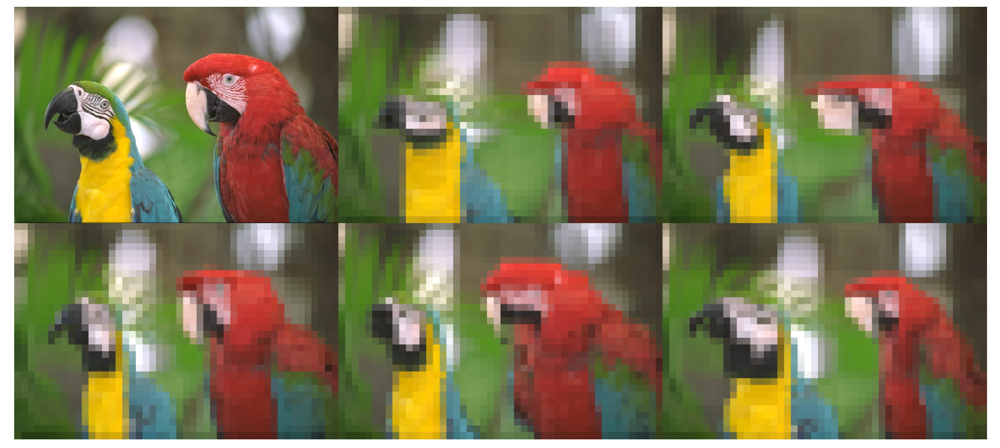
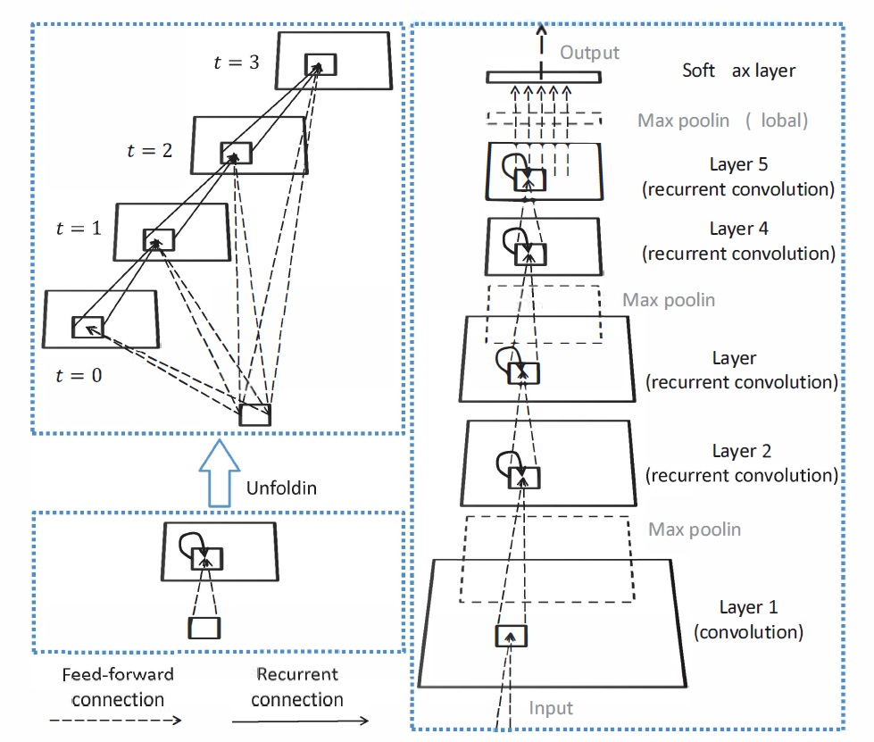

# Fractional Max Pooling and Recurrent Convolutional Neural Network

## Requirements
- Python3.6
- TensorFlow-gpu 1.13
- NumPy
- Keras

## Fractional Max Pooling
This repository is implemented based on [Fractional Max-Pooling](https://arxiv.org/abs/1412.6071) which is written by Benjamin Graham in 2014. It is the top-1 model in [CIFAR-10 result list](http://rodrigob.github.io/are_we_there_yet/build/classification_datasets_results.html#43494641522d3130).



#### Usage
`python train_dev_model.py --name fmp [--gpu gpu_idx] [--lr initial_learning_rate] [--drop drop_rate] [--filters filters_number] [--wdecay weight_decay]`

#### MNIST
The overall structure of the model can be expressed as follows: `(knC2 - FMP 2^{1/2})_7 - C1 - output,` where n denotes the nth layer and k denotes the filter number. 
Here is the comparison table on error rates.  

| Model						 	| Results (1 test/12 tests)	| 
|---------------------------	|----------------------		|	
| k = 32					   	|   1.04%/0.79%             |	
| k = 64        		        |   0.99%/0.83%             |	
| k = 96 						|	0.91%/0.73%				|		

#### CIFAR10
The model structure can be written as follows: `(knC2 - FMP 2^{1/3})_7 - C1 - output`, where n denotes the nth layer and k denotes the filter number. 
The size of input image is 32. 
Fraction max pooling layer is too slow on Tensorflow and it is not implemented on PyTorch. 

| Model						 	| Results (1 test/12 tests)	|
|---------------------------	|----------------------		|
| k = 64						|	13.03%/10.97%			|
| k = 96					   	|   11.58%/9.55%            |
| k = 128		                |   11.08%/9.61%            |

#### CIFAR100
The overall structure of the model can be represented as follows:
```
(knC2 - FMP 2^{1/3})_7 - C1 - output
```
The number of layers is reduced since it is too time consuming to train the network described in the paper and its performance is not very good on the train set and validation set. The input images are resized to (46, 46). The model is trained without dropout and data argumentation.

| Model						 	| Results (1 test/12 tests)	| 
|---------------------------	|----------------------		|
| k = 64				   		|   39.71%/37.15%           |	
| k = 96			            |   35.97%/32.92%           |	
| k = 128						|	34.72%/32.12%			|
| k = 160						| 	34.11%/31.73%			|


## Recurrent Convolutional Neural Network
The code of this part is implemented according to [Recurrent Convolutional Neural Network for Object Recognition](https://ieeexplore.ieee.org/document/7298958/). 
Local response normalization is replaced by batch normalization. Only last hidden layer is followed by a dropout layer. Adam optimizer is used to optimize the model. Learning rate decays exponentially. Image shift and horizental flip are utilized for data augmentation.



### Usage
`python train_dev_model.py --name rcnn [--gpu gpu_idx] [--lr initial_learning_rate] [--drop drop_rate] [--filters filters_number] [--wdecay weight_decay]`

### MNIST

| model                      	| Error Rate    	| 
|---------------------------	|----------------	|
| filters 32 (one crop)			|	1.07%			|
| filters 64 (one crop)			|	1.02%			|
| filters 96 (one crop)			|   0.93%           |	
| filters 128 (one crop)        |   0.87%           |	
| filters 160 (one crop)		|	0.86%			|
| filters 32 (paper)			| 	0.42%			|
| filters 64 (paper)			| 	0.32%			|
| filters 96 (paper)			|	0.31%			|

### CIFAR10

| model                      	| Error Rate        | 
|---------------------------	|-----------------	|
| 96 filters (one crop)			|   10.53%          |
| 128 filters (one crop)		|	9.21%			|
| 160 filters (one crop)		|	8.89%			|
| 96 filters (paper, nine crop) |   7.37%           |
| 128 filters (paper, nine crop)| 	7.24%			|
| 160 filters (paper, nine crop)|	7.09%			|

### CIFAR100
The model reported by the paper is trained without data augmentation. Our model adopt the same hyper-parameters from the model for CIFAR10.

| model                      	| Error Rate        | 
|---------------------------	|-----------------	|
| 96 filters (one crop)			|   39.58%          |
| 128 filters (one crop)		|	36.26%			|
| 160 filters (one crop)		|	34.75%			|
| 96 filters (paper, nine crop) |   34.18%          |
| 128 filters (paper, nine crop)|	32.59%			|
| 160 filters (paper, nine crop)|	31.75%			|	
